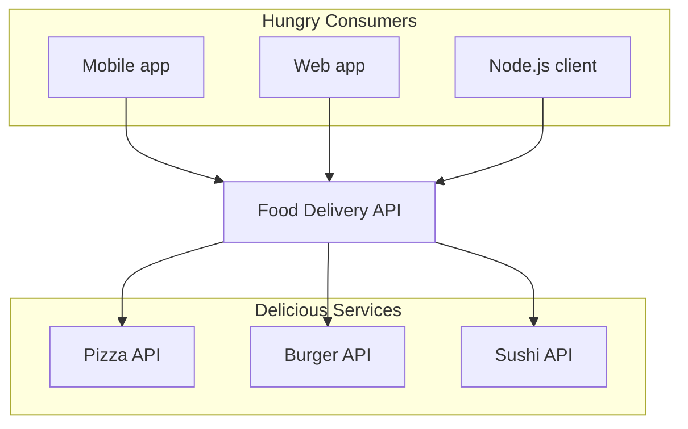

```mermaid
graph TD;
  subgraph AA [Hungry Consumers]
    A[Mobile app];
    B[Web app];
    C[Node.js client];
  end
  subgraph BB [Delicious Services]
    E[Pizza API];
    F[Burger API];
    G[Sushi API];
  end
  Z[Food Delivery API];
  A --> Z;
  B --> Z;
  C --> Z;
  Z --> E;
  Z --> F;
  Z --> G;
```