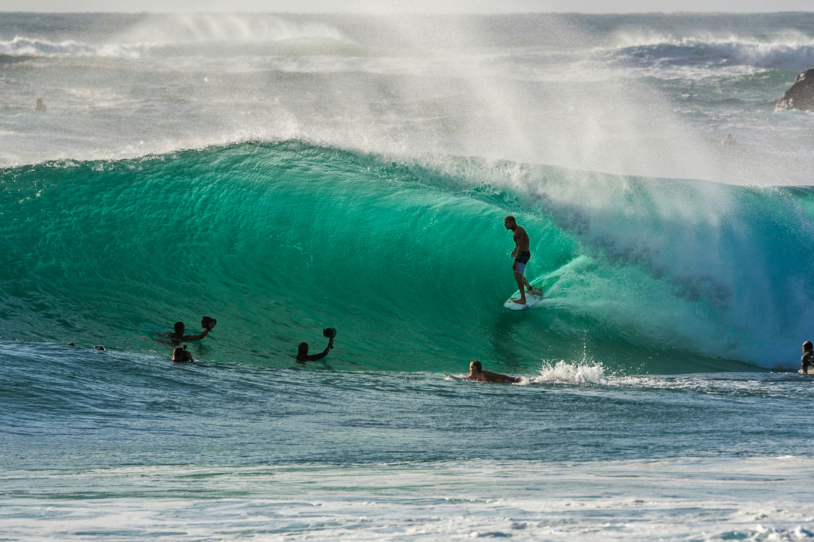

import { Bleed } from 'nextra-theme-docs'

## Imagenes de Surf

<Bleed>Tenemos varias imagenes usando bleed, que son elementos o componentes que se extienden más allá de sus restricciones de diseño habituales. </Bleed>

<Bleed full></Bleed>

<Bleed left></Bleed>

<Bleed right></Bleed>

<Bleed bottom></Bleed>

<Bleed full>
  <iframe
    src="https://codesandbox.io/embed/swr-states-4une7"
    width="100%"
    height="500px"
    title="SWR-States"
  />
</Bleed>